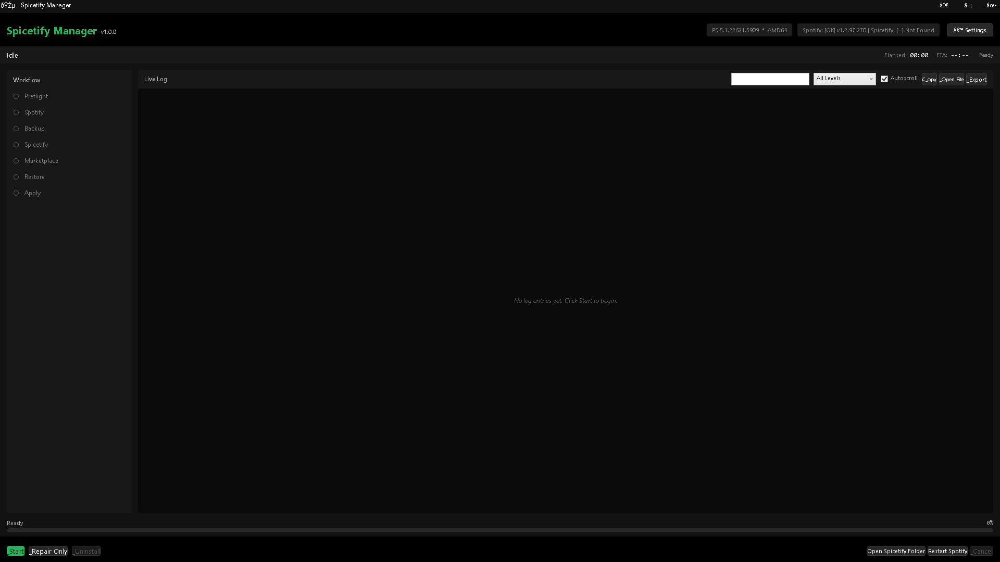

# SpicetifyManager

[](https://github.com/Dalbouh02/SpicetifyManager/releases)
[](LICENSE)
[](https://learn.microsoft.com/powershell/scripting/install/installing-powershell)
[](https://www.microsoft.com/windows)
[](https://github.com/Dalbouh02/SpicetifyManager/releases)
[](https://github.com/Dalbouh02/SpicetifyManager/stargazers)
[](https://github.com/Dalbouh02/SpicetifyManager/commits/main)

PowerShell tool for installing, repairing, backing up, and uninstalling Spicetify and Spotify on Windows. Single `.ps1` file, WPF GUI plus console mode.



## Requirements

- Windows 10 or 11
- PowerShell 5.1 (preinstalled) or PowerShell 7+
- Administrator privileges
- Internet connection

## Quick start

1. Download [`SpicetifyManager.ps1`](https://github.com/Dalbouh02/SpicetifyManager/releases/latest/download/SpicetifyManager.ps1) from the latest release.
2. Right-click → **Run with PowerShell** → **Open** on the execution policy prompt.
3. Click **Install**.

## Switches if you dont want to use the GUI

| Switch | Effect |
|---|---|
| `-NoUI` | Console mode, no WPF window. For CI or scheduled tasks. |
| `-Repair` | Reinstall Spotify, recreate Spicetify backup, re-apply config. |
| `-Uninstall` | Remove Spicetify and restore stock Spotify. |
| `-Diagnose` | Print environment info and exit. No side effects. |
| `-KeepLog` | Keep the run log on success (deleted by default). |
| `-SkipPreflight` | Skip the pre-flight environment checks. |
| `-LogPath <path>` | Override the default log location. |
| `-CacheDir <path>` | Override the spicetify cache directory. `none` disables caching. |
| `-MaxRetries <n>` | Network retry count. Default `3`. |
| `-RetryDelayMs <n>` | Milliseconds between retries. Default `2000`. |
| `-ProcessTimeoutMs <n>` | Per-process execution timeout in ms. Default `90000`. |
| `-BackupRetention <n>` | Number of backup snapshots to keep. Default `3`. |
| `-FromLauncher` | Internal flag. Suppresses the "Press any key" prompt. |

### Examples

```powershell
# Full install with GUI (default)
powershell -ExecutionPolicy Bypass -File .\SpicetifyManager.ps1

# Headless install (CI / scheduled task)
powershell -ExecutionPolicy Bypass -File .\SpicetifyManager.ps1 -NoUI

# Repair a broken install
powershell -ExecutionPolicy Bypass -File .\SpicetifyManager.ps1 -Repair

# Uninstall Spicetify, restore stock Spotify
powershell -ExecutionPolicy Bypass -File .\SpicetifyManager.ps1 -Uninstall

# Print environment diagnostics
powershell -ExecutionPolicy Bypass -File .\SpicetifyManager.ps1 -Diagnose
```

## Features

- Install, update, repair, uninstall Spicetify and Spotify (it will download both of them even if you dont have any.)
- Detect and refuse the Microsoft Store version of Spotify.
- Snapshot themes, extensions, config, and `spicetify/Custom` before destructive operations; keep the last N backups (default 3, configurable)
- Preflight checks: disk space, network, architecture, Spotify Store-vs-desktop
- Crash log to `%TEMP%\SpicetifyManager_CRASH_<timestamp>.log`, console held open for 10 seconds so the path can be copied
- Console mode (`-NoUI`) for CI and scheduled tasks
- State stored under `%APPDATA%\SpicetifyManager\` so it survives a Spicetify uninstall
- Single file. No installer, no module manifest, no DLLs etc.

## File layout

| Path | Purpose |
|---|---|
| `%APPDATA%\SpicetifyManager\config.json` | User preferences |
| `%APPDATA%\SpicetifyManager\stats.json` | Install / uninstall counters |
| `%APPDATA%\SpicetifyManager\windowstate.json` | GUI window position and size |
| `%TEMP%\SpicetifyManager_<yyyyMMdd>.log` | Run log (deleted on success unless `-KeepLog`) |
| `%TEMP%\SpicetifyManager_CRASH_<timestamp>.log` | Crash report. Never deleted. |

## Exit codes

| Code | Meaning |
|---|---|
| `0` | Success |
| `5` | Preflight failure |
| `10` | Spotify install / detect failure |
| `15` | Backup failure |
| `20` | Spicetify install / update failure |
| `25` | Marketplace install failure |
| `30` | Restore failure |
| `35` | Apply (config) failure |
| `40` | Repair failure |
| `45` | Uninstall failure |
| `99` | General error |

## Releases

Grab the latest `SpicetifyManager.ps1` from [the releases page](https://github.com/Dalbouh02/SpicetifyManager/releases). Each release attaches the script as a downloadable asset.

## FAQ

**Is this safe?**
The script writes to `%APPDATA%`, `%LOCALAPPDATA%\spicetify`, `%TEMP%`, and (when installing Spotify) `%LOCALAPPDATA%\Spotify`. Network calls go to `github.com` (Spicetify release metadata), `raw.githubusercontent.com` (Spicetify CLI download), `download.scdn.co` (Spotify installer), and `api.github.com` (Marketplace metadata). Run `-Diagnose` to inspect the environment probe.

**Will it survive a Spotify update?**
Yes — Spotify updates reset the modified files. Re-run the script and choose **Repair** to recreate the Spicetify backup and re-apply the config. Your customization's are preserved across the repair because they're snapshotted before re-apply but some extinctions may break because they get outdated after the updated i will add block updates button in the future this will keep everything forever and the user decide to unblock it and update when ever he want.

**Why is the console window hidden in GUI mode?**
The WPF window is the interface. The backing PowerShell console is the host process. On any unhandled error the console is re-shown and held open for 10 seconds so the crash report can be read and the log path copied.

**The script says "Spotify Store version detected" — what now?**
Spicetify cannot modify the Microsoft Store version of Spotify (UWP package, files locked). Open **Settings → Apps → Installed apps**, uninstall "Spotify" (the Store version), then run the script again. It will install the standard desktop version from `download.scdn.co` automatically you just need to delete the Microsoft Store version of Spotify.

**Where is my config / backup / log?**
See the **File layout** table above.

## Acknowledgments

- [Spicetify](https://github.com/spicetify/cli)
- [Spicetify Marketplace](https://github.com/spicetify/marketplace)
- [Spotify](https://www.spotify.com)

## License

GNU General Public License v3.0. See [LICENSE](LICENSE).
